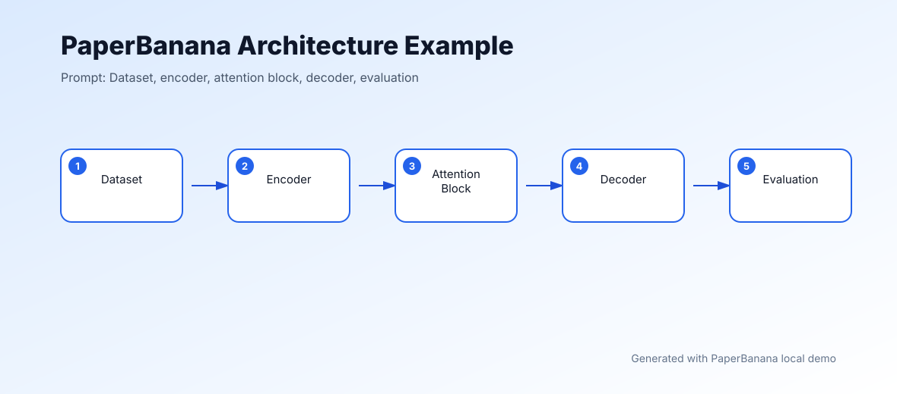
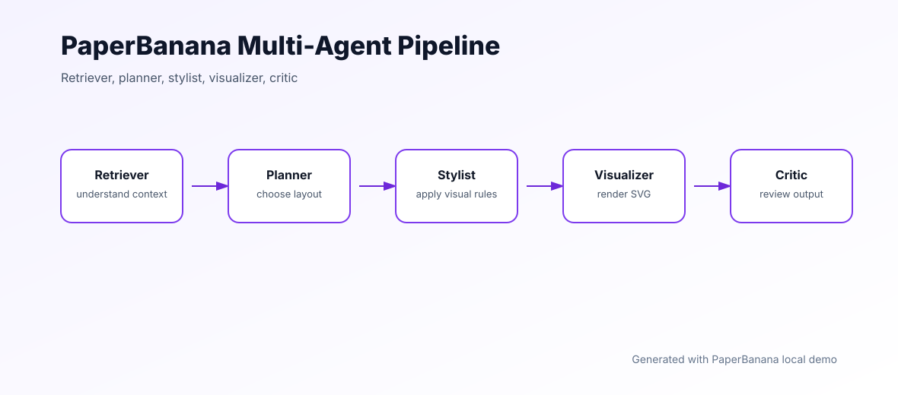

# PaperBanana

PaperBanana is an AI-assisted academic diagram generator for researchers, students, educators, and technical teams. It turns research descriptions, rough figure ideas, and workflow notes into clean diagram drafts that can be refined for papers, slides, reports, and documentation.

[Try PaperBanana online](https://paper-banana.net/) | [Usage guide](USAGE.md) | [Example output](examples/architecture.svg)



## What it does

PaperBanana focuses on fast figure drafting rather than replacing a final design pass. The local demo in this repository generates a structured SVG diagram from a text prompt so contributors can understand the workflow without needing a hosted model or GPU.

Core capabilities:

- Text-to-diagram generation for research workflows, ML pipelines, and system architecture
- Sketch-to-vector workflow concept for turning rough figure ideas into polished visuals
- Style presets for clean technical figures, journal-style diagrams, and modern AI visuals
- SVG output that can be embedded in Markdown, LaTeX, Notion, or documentation sites
- A simple multi-agent planning model: retrieve context, plan layout, style, render, review

## Example prompts

```bash
python inference.py \
  --input "Transformer research pipeline: dataset, encoder, attention block, decoder, evaluation" \
  --style clean_tech \
  --output outputs
```

```bash
python inference.py \
  --input "Clinical study workflow: patient cohort, preprocessing, model training, validation, report" \
  --style classic_journal
```

The command writes an SVG file such as `outputs/diagram.svg`.

## Repository structure

```text
paper-banana/
├── inference.py              # Lightweight local SVG generator
├── default.yaml              # Style and output configuration
├── examples/
│   ├── architecture.svg      # Sample architecture figure
│   └── pipeline.svg          # Sample workflow figure
├── USAGE.md                  # Installation and CLI examples
├── requirements.txt          # Minimal runtime dependencies
└── setup.py                  # Package metadata
```

## How the demo works

The local demo uses a deterministic planning pipeline:

1. Parse the prompt into diagram nodes.
2. Choose a style preset from `default.yaml`.
3. Lay out the nodes in a publication-friendly horizontal flow.
4. Render an SVG with labels, arrows, captions, and metadata.
5. Save the output for editing or embedding.

This is intentionally lightweight. The online version can provide richer AI-assisted generation, while the repository gives developers a real runnable baseline.

## Styles

| Style | Best for | Visual tone |
| --- | --- | --- |
| `clean_tech` | ML systems, technical docs, architecture figures | Blue, modern, high contrast |
| `classic_journal` | Papers, reports, formal slides | Grayscale, restrained, print friendly |
| `modern_ai` | AI demos, product explainers, research blogs | Purple accent, presentation ready |

## Sample output



## Local setup

```bash
pip install -r requirements.txt
python inference.py --input "Data preprocessing pipeline: load, clean, transform, train, evaluate"
```

No GPU is required for the repository demo.

## Use cases

- Research paper figures
- Machine learning architecture diagrams
- Scientific workflow illustrations
- Lab meeting slides
- Technical blog graphics
- Educational diagrams
- Product and system explainers

## Roadmap

- [x] Runnable local SVG demo
- [x] Example diagrams in the repository
- [x] Configurable visual styles
- [ ] Web API examples
- [ ] Batch figure generation
- [ ] LaTeX export snippets
- [ ] Diagram editing instructions

## License

This project is released under the MIT License.
